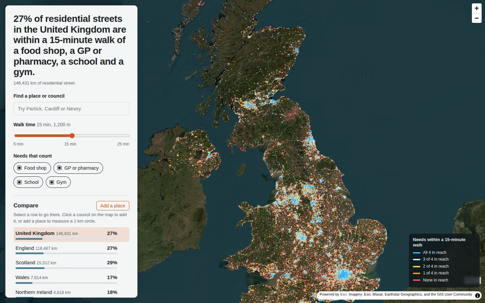
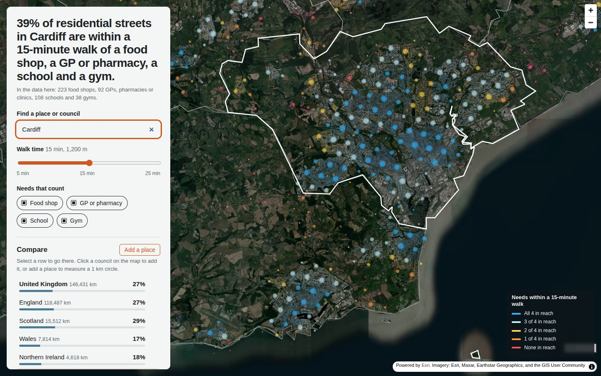
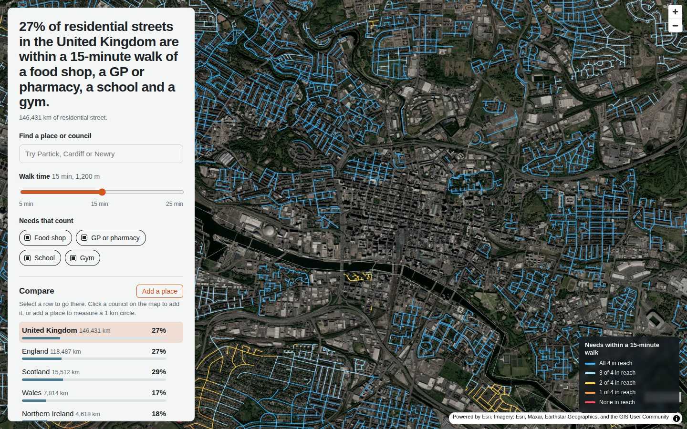
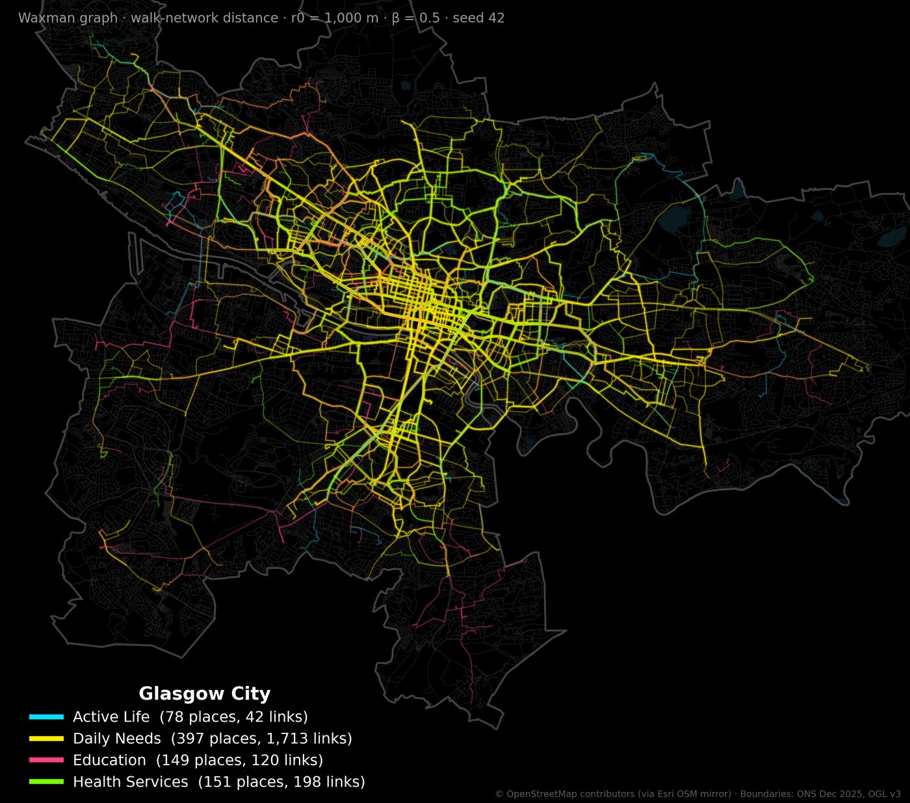

# UK 15-minute walk

Nearly three-quarters of the UK's residential street length is more than a 15-minute walk from at least one of four daily needs. On OpenStreetMap's current data, 27% of it is within 1,200 m of a food shop, a GP or pharmacy, a school and a gym. Gyms are the gap almost everywhere: 35% of residential street length reaches one, against 85% for a food shop.



This repository measures walking access for every residential street in all 361 UK councils and publishes an interactive map for exploring and comparing places.

**Live map:** `https://duncanCI.github.io/uk-15-minute-walk/` (the Glasgow v0.1 map is at `/glasgow.html`)

## What it measures

For every residential street segment, the pipeline finds the walking distance from the segment's midpoint to the nearest place in each category. Walks follow footways, paths and streets. 15 minutes is 1,200 m at 4.8 km/h.

| Need | OpenStreetMap tags |
|---|---|
| Food shop | `shop=supermarket`, `shop=convenience` |
| GP or pharmacy | `amenity=doctors`, `pharmacy`, `clinic`, `hospital` |
| School | `amenity=school`, plus `building=school` footprints grouped into sites within 150 m |
| Gym | `leisure=fitness_centre`, `sports_centre`, `gym` |

A segment counts for a need when its midpoint is within the walk. Shares are by residential street length (`highway=residential` and `living_street`). Each council is processed with a 2 km margin, so a street near a boundary can use the shop over the line. Great Britain runs in British National Grid and Northern Ireland in Irish Transverse Mercator.

## What it cannot tell you

- **OpenStreetMap completeness drives the bottom of the ranking.** Bolsover (0.4%) and Castle Point (0.6%) come last, with 2 and 2 gyms in the data. The map shows each council's place counts under the headline. Check a low figure against NHS, council or Companies House records before quoting it.
- **Street length stands in for people.** A street of tenements counts the same as a cul-de-sac. Population weighting is next on the roadmap.
- **School grounds are missing** from the data source used here. School buildings grouped into sites stand in for them.
- **A path is a path.** Hills, unlit paths and busy crossings count the same as any other route.

## Results: 15-minute walk

Share of residential street length within 1,200 m of each need.

| Nation | Street km | Food shop | GP or pharmacy | School | Gym | All four |
|---|---:|---:|---:|---:|---:|---:|
| England | 118,487 | 87% | 69% | 78% | 36% | 27% |
| Scotland | 15,512 | 82% | 63% | 77% | 40% | 29% |
| Wales | 7,814 | 75% | 52% | 70% | 24% | 17% |
| Northern Ireland | 4,618 | 74% | 46% | 73% | 28% | 18% |
| **United Kingdom** | **146,431** | **85%** | **67%** | **78%** | **35%** | **27%** |

The highest councils are City of London (99.9%), Tower Hamlets (97.8%) and Islington (95.8%). The full ranking for any walk time and any mix of needs is in the map.



## The map

- **Satellite basemap:** Esri World Imagery, dimmed and desaturated so the data reads on top, with a place-name overlay.
- **Zoomed out:** soft translucent dots, one per H3 hexagon of about 0.7 km², sized by street length and coloured by the typical street.
- **Zoomed in:** every residential street, coloured by how many of the selected needs it reaches. Council files load as you pan, averaging 160 KB each.
- **Controls:** walk time from 5 to 25 minutes, any mix of needs, search across 60,000 places and every council, a 1 km circle you can drop anywhere, and a ranked list filterable by nation. The map position lives in the URL, so views can be shared.



## Run it

Python 3.11 or later.

```bash
pip install -r requirements.txt
python -m pipelines.uk fetch    # OSM for all 361 councils into cache/ (resumable, about 70 min)
python -m pipelines.uk build    # distances, stats and street files (about 10 min)
python -m pipelines.uk merge    # web/data/ for the map
python -m http.server -d web    # then open http://localhost:8000
```

Add `--only S12000049 N09000003` to fetch or build named councils. The Glasgow v0.1 pipeline and its static maps still run with `python -m pipelines.glasgow_region`.

| Path | Purpose |
|---|---|
| `fifteen/sources.py` | OpenStreetMap from Esri's hosted mirror (ArcGIS REST), plus ONS boundaries and place names. |
| `fifteen/core.py` | Street graph, POI assembly, network Waxman graph and walking distances. |
| `pipelines/uk.py` | The UK build: per-council fetch, build and merge. |
| `pipelines/glasgow_region.py` | Glasgow v0.1: static maps and the council table. |
| `pipelines/build_web.py` | Glasgow v0.1: the self-contained `web/glasgow.html`. |
| `pipelines/validate.py` | Confirms the scipy engine returns the same edges as `city2graph.waxman_graph`. |
| `web/index.html` | The UK map. Reads `web/data/`. |

## Where this came from

Milan Janosov's [#30DayMapChallenge tutorial](https://milanjanosov.substack.com/p/how-walkable-is-your-city-analyzing) used [city2graph](https://city2graph.net) to draw Waxman graphs between points of interest on a street network. v0.1 reproduced those maps for Glasgow and changed six things for UK use: metric distances instead of EPSG:3857 (which overstates distance by 1.78x at Glasgow's latitude), mapped areas as well as points (the original filter finds 0 gyms in Glasgow), UK tags, the walk network with Scottish access rights, a scipy engine that returns city2graph's exact edges 40 times faster, and the shortest of two parallel street segments.



## Licences and credits

- **Code:** MIT, see [LICENSE](LICENSE).
- **Derived data** (everything in `web/data/` and `out/`): [ODbL 1.0](https://opendatacommons.org/licenses/odbl/), © OpenStreetMap contributors.
- **Boundaries and place names:** Source: Office for National Statistics licensed under the Open Government Licence v3.0. Contains OS data © Crown copyright and database right 2025.
- **Imagery:** Powered by Esri. Esri, Maxar, Earthstar Geographics, and the GIS User Community. Esri's terms require this attribution, and Esri expects an ArcGIS account for production use of its basemaps.
- **city2graph** is BSD-3-Clause. `waxman_network()` reimplements its algorithm, see [NOTICE.md](NOTICE.md).
- **Method credit:** Milan Janosov's tutorial, linked above.
